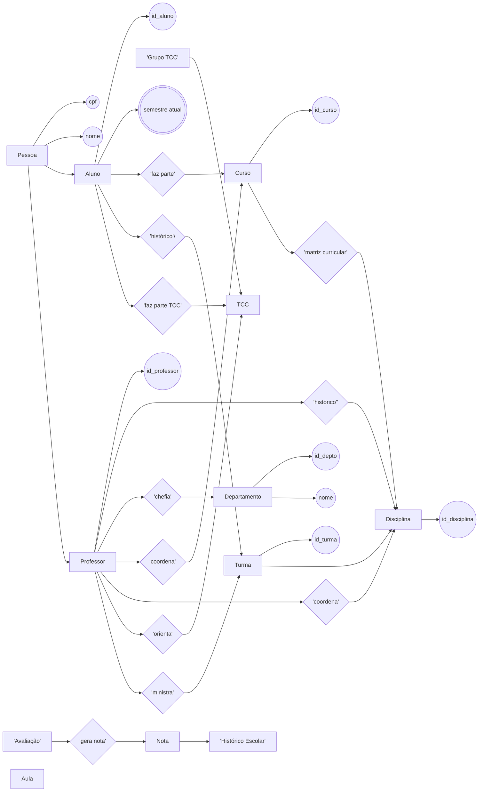

```mermaid
flowchart LR
  %% Entidades
  Pessoa[Pessoa]
  Aluno[Aluno]
  Professor[Professor]
  Depto[Departamento]
  Curso[Curso]
  Disciplina[Disciplina]
  Turma[Turma]
  Avaliacao['Avaliação']
  Nota[Nota]
  Historico['Histórico Escolar']
  Aula[Aula]
  GrupoTCC['Grupo TCC']
  TCC[TCC]

  %% Atributos de Pessoa
  p_cpf((cpf))
  p_nome((nome))
  Pessoa --> p_cpf
  Pessoa --> p_nome

  %% Aluno
  a_id((id_aluno))
  a_sem(((semestre atual)))
  Aluno --> a_id
  Aluno --> a_sem
  Pessoa --> Aluno

  %% Professor
  pr_id((id_professor))
  Professor --> pr_id
  Pessoa --> Professor

  %% Depto
  d_id((id_depto))
  d_nome((nome))
  Depto --> d_id
  Depto --> d_nome

  %% Curso
  c_id((id_curso))
  Curso --> c_id
  %% Disciplina
  dis_id((id_disciplina))
  Disciplina --> dis_id

  %% Turma
  t_id((id_turma))
  Turma --> t_id

  %% Relações (losangos)
  FazParteAlunoCurso{'faz parte'}
  Aluno --> FazParteAlunoCurso
  FazParteAlunoCurso --> Curso

  MatrizCurricular{'matriz curricular'}
  Curso --> MatrizCurricular
  MatrizCurricular --> Disciplina

  HistoricoAluno{'histórico'\}
  Aluno --> HistoricoAluno
  HistoricoAluno --> Turma
  Turma --> Disciplina

  HistoricoProfessor{'histórico''}
  Professor --> HistoricoProfessor
  HistoricoProfessor --> Disciplina

  Chefia{'chefia'}
  Professor --> Chefia
  Chefia --> Depto

  CoordenacaoCurso{'coordena'}
  Professor --> CoordenacaoCurso
  CoordenacaoCurso --> Curso

  CoordenacaoDisc{'coordena'}
  Professor --> CoordenacaoDisc
  CoordenacaoDisc --> Disciplina

  Orientacao{'orienta'}
  Professor --> Orientacao
  Orientacao --> TCC

  TccAluno{'faz parte TCC'}
  Aluno --> TccAluno
  TccAluno --> TCC

  AulaMinistrada{'ministra'}
  Professor --> AulaMinistrada
  AulaMinistrada --> Turma

  %% Conectores adicionais
  GrupoTCC --> TCC

  NotaRel{'gera nota'}
  Avaliacao --> NotaRel
  NotaRel --> Nota
  Nota --> Historico
```
