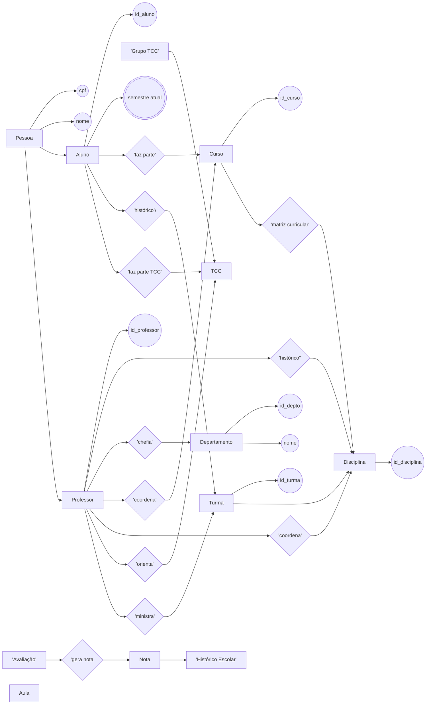

# Projeto de Banco de Dados para Universidade

## Integrantes
- **Gustavo Bertoluzzi Cardoso** – RA 22.123.016-2  
- **Isabella Vieira Silva Rosseto** – RA 22.222.036-0  

---

## Descrição do Projeto
Este repositório contém a implementação de um sistema de banco de dados relacional para uma universidade. O objetivo é:

- Modelar entidades como **Pessoas** (alunos e professores), **Departamentos**, **Cursos** e **Disciplinas**.  
- Registrar **Aulas** ministradas, **Histórico Escolar** (notas, reprovações e aprovações) e **Grupos de TCC** com seus orientadores.  
- Garantir normalização até a 3FN e estruturar consultas SQL para análises acadêmicas.

---

## Como executar o Projeto

1. **Criar um banco no Supabase**  
   - Acesse [Supabase](https://supabase.com/) e crie um novo projeto.  
   - No painel do projeto, acesse **Database → SQL Editor**.

2. **Executar o script DDL**  
   - Encontre o arquivo `criar.sql` neste repositório.  
   - No SQL Editor do Supabase, copie e cole todo o conteúdo de `criar.sql` e execute para criar as tabelas.

3. **Popular com dados fictícios**  
   - Abra o arquivo `gerador.py`.  
   - Ajuste a variável `PASSWORD` para a senha do seu database Supabase.  
   - No terminal, instale as dependências (se ainda não estiverem instaladas):
     ```bash
     pip install psycopg2-binary Faker
     ```
   - Execute:
     ```bash
     python gerador.py
     ```
   - Isso irá conectar-se ao seu banco Supabase e inserir dados fictícios em todas as tabelas.

4. **Rodar as consultas SQL**  
   - No mesmo SQL Editor, abra o arquivo `queries.sql` e execute cada query para validar as respostas.

---

## Modelo Relacional (MR)


---

## Modelo Entidade‑Relacionamento (MER)


