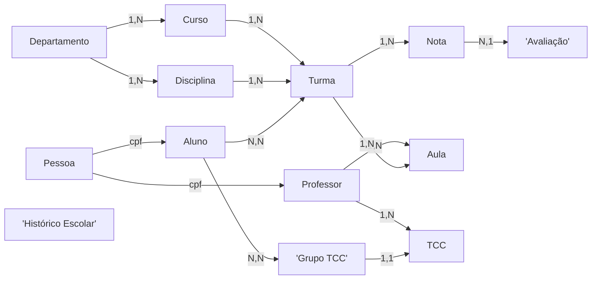

<!-- README.md gerado automaticamente  -->

  
  
  

<h1 align="center">🎓 Banco de Dados Universitário</h1>

Um projeto acadêmico completo que modela todo o ecossistema de uma universidade – de alunos a TCCs – usando <strong>PostgreSQL</strong> e <strong>Python</strong>.

---

## 👥 Integrantes
| Nome | RA |
|------|----|
| **Gustavo Bertoluzzi Cardoso** | 22.123.016-2 |
| **Isabella Vieira Silva Rosseto** | 22.222.036-0 |

---

## 🗺️ Visão Geral
> **Objetivo:** Criar um sistema relacional totalmente normalizado (3FN) capaz de gerenciar:
> 
> - **Pessoas** (alunos & professores)  
> - **Departamentos, Cursos & Disciplinas**  
> - **Aulas**, **Histórico Escolar** e **Matriz Curricular**  
> - **Grupos & Projetos de TCC**  

O projeto inclui **DDL**, **scripts de popularização**, **validações** e **consultas SQL** que respondem às perguntas de negócio exigidas.

---

## 🧭 Índice
1. [Pré‑requisitos](#pré‑requisitos)
2. [Configuração Rápida](#configuração-rápida)
3. [Scripts Essenciais](#scripts-essenciais)
4. [Modelos](#modelos)
5. [Consultas SQL](#consultas-sql)
6. [Licença](#licença)

---

## 📦 Pré‑requisitos
- Conta gratuita no **Supabase**  
- **Python 3.10+**  
- **pip** (ou **pipx**)  
- Acesso ao **SQL Editor** do Supabase  

---

## ⚡ Configuração Rápida

<strong>Passo‑a‑passo detalhado (clique para expandir)</strong>

1. ### 🚀 Criar banco no Supabase  
   - Acesse <https://supabase.com> → **New Project** → defina nome, senha e região.

2. ### 🗄️ Executar DDL  
   - No dashboard → **Database ▸ SQL Editor** → crie nova query.  
   - Cole o conteúdo de <kbd>criar.sql</kbd> e clique <kbd>Run</kbd>.

3. ### 🐍 Popular com dados fictícios  
   - Abra <kbd>gerador.py</kbd> conecte com o seu banco de dados mudando a senha e outros dados.

4. ### 🔍 Rodar consultas  
   - Abra <kbd>queries.sql</kbd> no SQL Editor do Supabase ou no seu cliente favorito (DBeaver, psql etc.)  
   - Execute e observe os resultados.  

---

## 🛠️ Scripts Essenciais
| Arquivo | Descrição |
|---------|-----------|
| `criar.sql` | Criação de todas as tabelas, chaves e restrições. |
| `gerador.py` | Gera CPFs, nomes, turmas, notas, TCCs e populariza o banco. |
| `queries.sql` | Contém as 5 queries obrigatórias + 10 queries extras. |
| `valida_dados.sql` | Checa consistência referencial & contagens esperadas. |

---

## 🗂️ Modelos

### Modelo Relacional (MR)

### Modelo Entidade‑Relacionamento (MER)

---

## 📊 Consultas SQL
As queries obrigatórias e adicionais estão em `queries.sql´
---

## 📝 Licença
Este projeto utiliza a licença **MIT** – fique à vontade para estudar, modificar e distribuir. Divirta‑se! ✨
